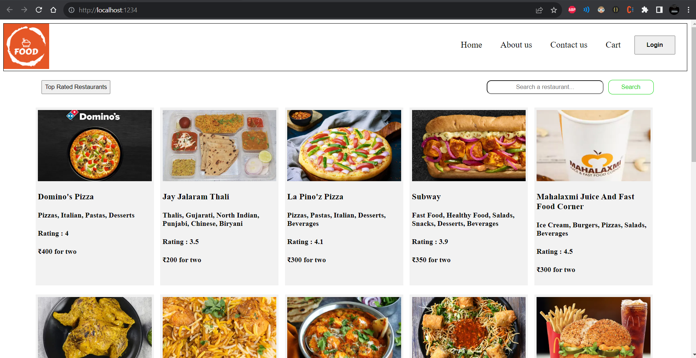

## How to Start this Project

1. Use `npm install` it will install required node_modules
2. Use `npm start` it will start the project on web at `http://localhost:1234/`
3. For `CORS` Error use `Allow CORS: Access-Control-Allow-Origin` Extension in chrome and Activate it.

## Output:

